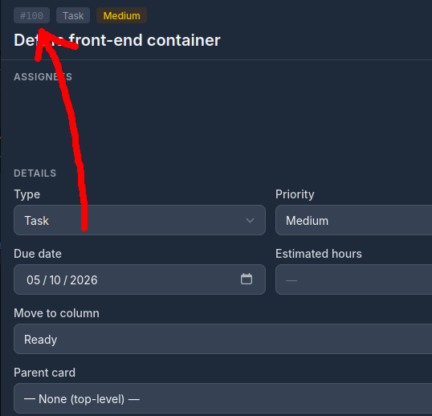
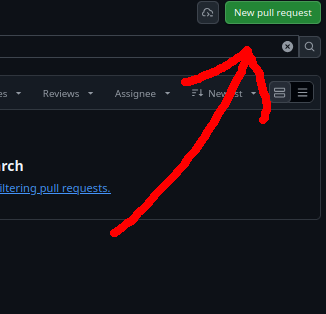
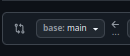

# ShitIsaid.com

----

##### Shitisaid.com is a free-to-use transcripts amalgamator.

##### It accepts a wide range of artifacts, converts them to transcripts, and allows

##### the user to store, browse, and access them easily and conveniently online.

##### The website accepts a variety of text, audio, and video formats, as well as URLs for maximum convenience!

----

### Architecture

##### This application runs 3 parallel docker containers. Frontend, Backend, and Database.

##### They communicate via pre-established exposed ports. Separation improves control, scaling, and performance.

### Installation

You need [Docker](https://docs.docker.com/get-docker/) with the Compose plugin.
```
git clone https://github.com/shitisaid-com/shitisaid.com.git
cd shitisaid.com
cp .env.example .env
```

### Configuration

All settings live in `.env`, you'll need to set these before you can run anything:

| Variable            | Purpose                                     |
| ------------------- | ------------------------------------------- |
| `POSTGRES_USER`     | Database user created on first start        |
| `POSTGRES_PASSWORD` | Password for that user                      |
| `POSTGRES_DB`       | Name of the database created on first start |
| `POSTGRES_PORT`     | Port the database runs at (default `5432`)  |

**Version:** PostgreSQL 18 (`postgres:18`), pinned to the major version. Don't change it to `latest`: a new major version can't read existing data without a manual upgrade.

**Ports:** the database is published on `localhost:<POSTGRES_PORT>`. Set this in `.env` if `5432` is already in use. Containers will always reach it at `db:5432`.

**Schema:** Create a 'db_init' folder and put the `.sql` files inside, then uncomment the `db_init` line in `compose.yaml`. This will create the databases from the schema on the first run.

### Backend

The backend is a Flask API served by gunicorn (`python:3.14-slim`), currently published on `localhost:8000`. It connects to the database and doesnt do much else yet.

You can prove it is running using the basic health check endpoint:
```bash
curl -i localhost:8000/health
```

### Basic Commands:

```bash
docker compose up -d --build       # build and start in the background
docker compose ps                  # check status
docker compose logs -f db          # follow database logs
docker compose logs -f backend     # follow backend logs
docker compose down                # stop (data is kept)
docker compose down -v             # stop (data is destroyed)
```

Connect to the database:

```
docker compose exec db psql -U <POSTGRES_USER> <POSTGRES_DB>
```

Data is stored in the `pgdata` Docker volume, so it survives restarts and `docker compose down`.

To **wipe the database** and start fresh run `docker compose down -v`. This will wipe all data in the database.

----

## For Developers

### How to contribute?

1. Assign yourself a ticket on our [kanban](https://kommit.mccrimmon.me/projects/stuffisaid/board). Make sure it's assigned to you before you begin working on it!
2. Navigate to the directory with your cloned repository
3. checkout to main and run `git pull` to make sure your main branch is up to date (**very important**)
4. Take the number seen on the ticket and precede it with `T-` to (in this case) get `T-100` . Then create a new branch with this name using `git branch T-100`.
   
   
   
   
5. You can now checkout to your newly created branch with `git checkout T-100`, and begin work on the ticket!
6. Once requirements have been met, you can submit the ticket for a [pull request](https://docs.github.com/en/pull-requests/reference/pull-requests) on our [github page](https://github.com/shitisaid-com/shitisaid.com/pulls). Simply click "New pull request" and follow the wizard.
   
   
   
   
7. **Always make sure main is on the left-hand side**. You're pushing TO main, not FROM it.
   
   
   
   
8. If you see any merge conflicts, feel free to contact the rest of the team members. Those can be real bitches to solve.
   
   
   
   
